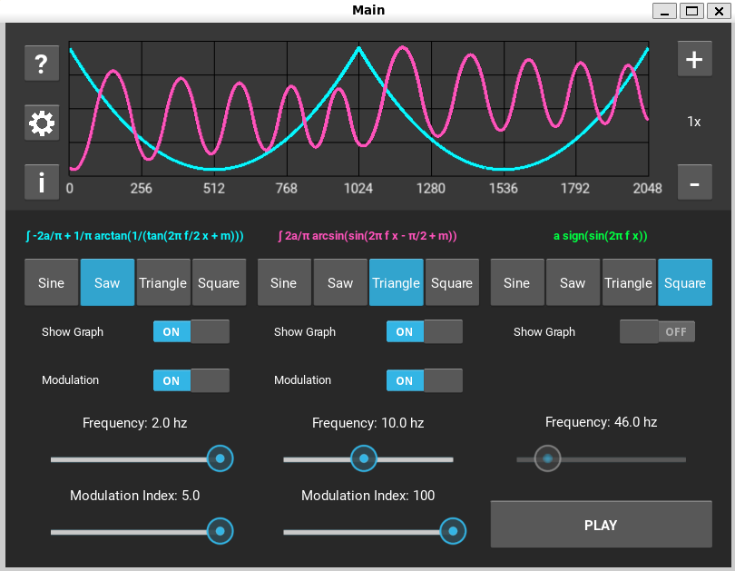
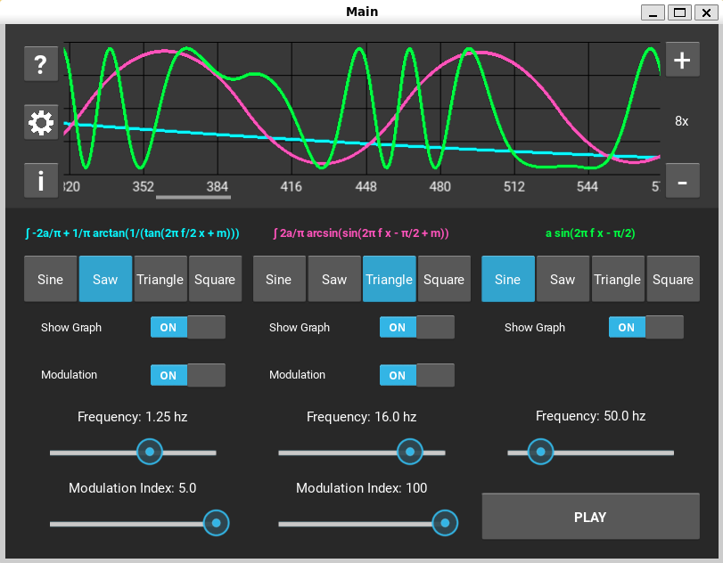
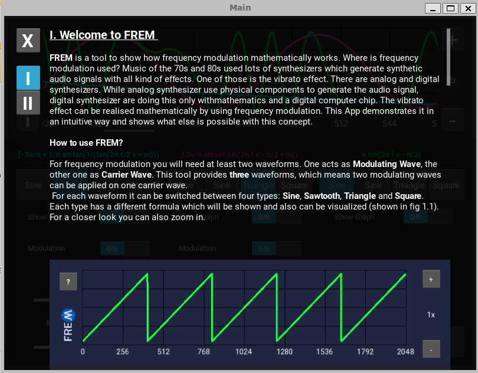
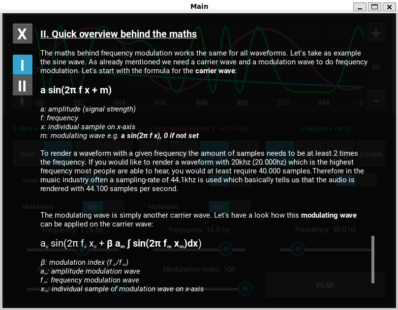
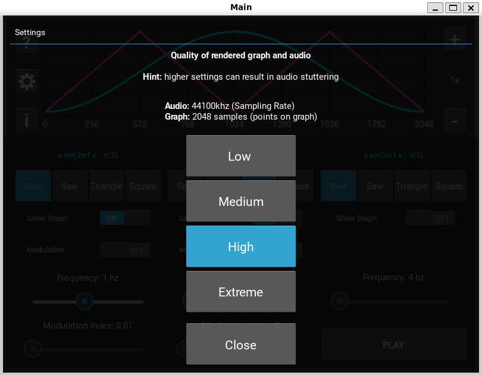
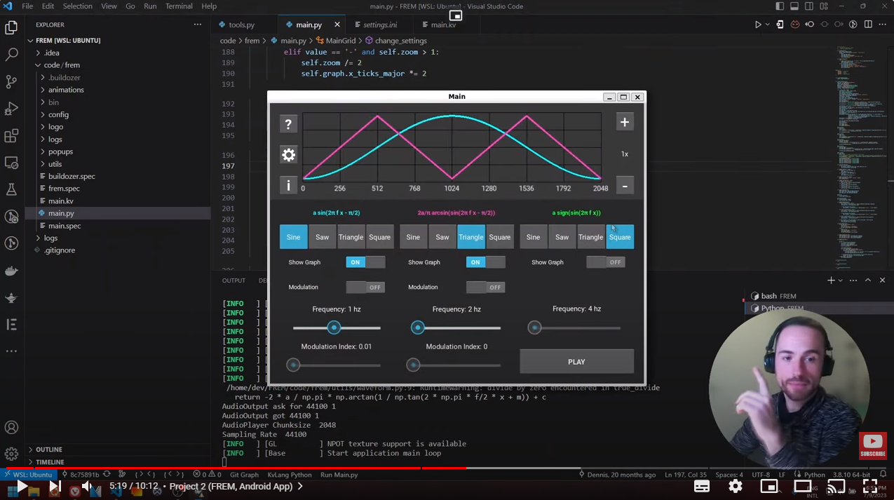

FREM is an Android app that teaches about frequency modulation in an interactive way. Frequency Modulation has been used in music production for audio synthesis where it is refered as FM synthesis. A popular example is Yamaha's Synthesizer DX7 from 1980. FREM let the user manipulate different waveforms and each change is visualized in realtime.
The result is rendered and can be listened to. In a nutshell the user can learn how to create audio effects like sirenes with frequency modulation.
The Android app is built using Python 3 and the cross-platform Kivy Framework. 

## Demo

## How to run it:

The project has a **main.py** which simply needs to be executed. To build the .apk and run it on your Android device, you need to use the buildtool Buildozer. The project contains already a buildozer.spec file which is required for buildozer to build the .apk file. For more information please check out the following tutorial:

## Contact
If you have any questions feel free to contact me.

 [Fullstacklab.net](www.fullstacklab.net) \
 [Instagram](instagram.com/thefullstacklab)
 